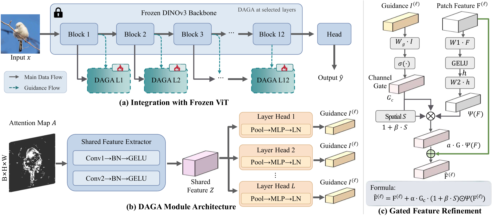
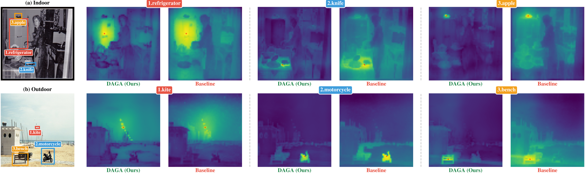

# DAGA: Dynamic Attention-Guided Adaptation for Self-Supervised Vision Transformers

<p align="center">
  <a href="https://neurips.cc"></a>
  <a href="LICENSE"></a>
</p>

This is the official PyTorch implementation of

> **DAGA: Dynamic Attention-Guided Adaptation for Self-Supervised Vision Transformers**
> Tianjian Zhou, Jiang Jie, Yishan Li, Yifei Zhang
> NeurIPS 2026 (Main Track)

---

## Abstract

We propose **DAGA** (Dynamic Attention-Guided Adaptation), a parameter-efficient fine-tuning method for self-supervised vision transformers. DAGA leverages frozen backbone attention maps as spatial guidance signals to dynamically adapt features for downstream tasks. Our method achieves competitive performance across multiple vision tasks while introducing minimal trainable parameters.

---

## Method

<p align="center">
  
</p>

DAGA consists of three key components:

| Component | Description |
|-----------|-------------|
| **Attention Encoder** | Encodes multi-head attention maps into compact guidance vectors |
| **Dynamic Gate Generator** | Produces instance-specific gating signals conditioned on attention patterns |
| **Feature Transformer** | Applies gated transformations with residual connections |

---

## Installation

```bash
# Create environment
conda create -n daga python=3.10 -y
conda activate daga

# Install PyTorch (adjust the CUDA version to your system)
pip install torch torchvision --index-url https://download.pytorch.org/whl/cu118

# Clone and install DINOv3 into the repository root
git clone https://github.com/facebookresearch/dinov3.git
cd dinov3 && pip install -e . && cd ..

# Install remaining dependencies
pip install -r requirements.txt
```

The `main_*.py` entry points expect the DINOv3 package at `./dinov3` (see `core/backbones.py`).

## Quick Start

### 1. Download Pretrained Weights

```bash
mkdir -p checkpoints
# DINOv3 ViT-B/16 pretrained weights (default backbone)
wget https://dl.fbaipublicfiles.com/dinov3/dinov3_vitb16/dinov3_vitb16_pretrain_lvd1689m-73cec8be.pth -P checkpoints/
```

Other backbones used in the paper: ViT-L/16 (`dinov3_vitl16_pretrain_lvd1689m-e9c0b6c9.pth`), ViT-S/16 (`dinov3_vits16_pretrain_lvd1689m-08c60483.pth`) from the same host.

For the DINOtxt text-image alignment entry point, additionally download the CLIP ViT-B/16 text-encoder weights:

```bash
wget "https://openaipublic.azureedge.net/clip/models/5806e77cd80f8b59890b7e101eabd078d9fb84e6937f9e85e4ecb61988df416f/ViT-B-16.pt" -P checkpoints/
```

### 2. Configure Paths

Edit `scripts/common_config.sh`:

```bash
CHECKPOINT_DIR="/path/to/checkpoints"
DEFAULT_GPU_IDS="0,1"
```

Dataset paths are set per script (e.g. `DATA_PATH` in `scripts/run_classification.sh`).

### 3. Run Experiments

```bash
# Classification
bash scripts/run_classification.sh

# Detection
bash scripts/run_detection.sh

# Segmentation
bash scripts/run_segmentation.sh

# Depth estimation
bash scripts/run_depth.sh

# Retrieval / robustness / frozen evaluations / DINOtxt / hyperparameter search
bash scripts/run_retrieval.sh
bash scripts/run_robustness.sh
bash scripts/run_knn.sh
bash scripts/run_linear.sh
bash scripts/run_logreg.sh
bash scripts/run_dinotxt.sh
bash scripts/run_optuna_search.sh
```

All entry points can also be invoked directly, e.g.:

```bash
torchrun --standalone --nproc_per_node=2 main_classification.py \
    --dataset cifar100 --data_path /path/to/cifar \
    --use_daga --daga_layers 1 2 10 11 \
    --pretrained_path checkpoints/dinov3_vitb16_pretrain_lvd1689m-73cec8be.pth
```

---

## Experiments

### Supported Tasks and Entry Points

| Task | Entry point | Datasets | Metric |
|------|-------------|----------|--------|
| Classification (fine-tuning) | `main_classification.py` | ImageNet-1K, CIFAR-10/100, Flowers-102, DTD, Pets, Cars, Food-101, SUN397 | Top-1 Acc |
| Object detection | `main_detection.py` | COCO 2017 | AP |
| Semantic segmentation | `main_segmentation.py` | ADE20K, Cityscapes, PASCAL VOC | mIoU |
| Depth estimation | `main_depth.py` | NYU Depth v2, KITTI | RMSE, AbsRel, δ<1.25 |
| Image retrieval | `main_retrieval.py` | Oxford5k, Paris6k | mAP |
| Robustness | `main_robustness.py` | ImageNet-C | mCE, Top-1 Acc |
| KNN evaluation | `main_knn.py` | ImageNet-1K, CIFAR-100 | Acc@k |
| Linear probing | `main_linear.py` | ImageNet-1K, CIFAR-100 | Top-1 Acc |
| Logistic regression | `main_logreg.py` | ImageNet-1K, CIFAR-100 | Top-1 Acc |
| Text-image alignment (DINOtxt) | `main_dinotxt.py` | COCO Captions | I2T/T2I R@1 |

### DAGA Layer Configuration

```bash
# Hourglass configuration (recommended)
--use_daga --daga_layers 1 2 10 11

# Deep layers only
--use_daga --daga_layers 8 9 10 11

# Full adaptation
--use_daga --daga_layers 0 1 2 3 4 5 6 7 8 9 10 11
```

### Hyperparameter Search

```bash
bash scripts/run_optuna_search.sh
```

### Reproducing Paper Comparisons

`paper_experiments/` contains the comparison suite used for the paper's baseline tables:

- `paper_experiments/main_comparison_*.py` — paired runners for DAGA vs. baselines per task (classification, detection, segmentation, depth, retrieval, VL retrieval, KNN, linear, logreg, robustness)
- `paper_experiments/methods/` — baseline implementations (AdaptFormer, LoRA, VPT, ViT-Adapter, layer fine-tuning)
- `paper_experiments/scripts/run_comparison_*.sh` — ready-made launch scripts

Example:

```bash
bash paper_experiments/scripts/run_comparison_segmentation.sh
```

### Visualization Tools

`visualization/` provides attention/feature-map visualization utilities (multi-layer attention on ImageNet/DTD, COCO detection attention, point attention, and quantitative analysis plots) used for the qualitative figures.

---

## Results

All numbers reported with DINOv3-ViT-B/16 backbone unless otherwise noted.

### Classification on ImageNet-1K

| Method | Params (M) | Top-1 Acc (%) |
|--------|------------|---------------|
| Baseline (Frozen) | 0.1 | 80.9 |
| Layer Fine-tuning | 22 | 85.9 |
| LoRA | 0.3 | 83.2 |
| AdaptFormer | 1.2 | 84.8 |
| ViT-Adapter | 1.5 | 85.1 |
| **DAGA (Ours)** | **1.2** | **85.9** |

Multi-seed (n=3): DAGA **85.77 ± 0.06**, the tightest seed-to-seed std among PEFT methods.

### Detection on COCO

| Method | Backbone | AP |
|--------|----------|-----|
| Baseline | DINOv3-B | 32.5 |
| AdaptFormer | DINOv3-B | 33.5 |
| ViT-Adapter | DINOv3-B | 32.8 |
| **DAGA (Ours)** | DINOv3-B | **35.6** |

### Segmentation on ADE20K

| Method | Backbone | mIoU |
|--------|----------|------|
| Baseline | DINOv3-B | 38.4 |
| AdaptFormer | DINOv3-B | 45.4 |
| ViT-Adapter | DINOv3-B | 47.0 |
| **DAGA (Ours)** | DINOv3-B | **50.5** |

### Depth Estimation on NYU Depth v2

| Method | RMSE ↓ | δ<1.25 ↑ |
|--------|----------|----------|
| Baseline | 0.469 | 88.0 |
| AdaptFormer | 0.446 | 90.4 |
| ViT-Adapter | 0.437 | 91.0 |
| **DAGA (Ours)** | **0.432** | **91.3** |

### Qualitative Visualization

<p align="center">
  
</p>

Category-wise feature-similarity heatmaps comparing DAGA against the frozen DINOv3 baseline on (a) indoor and (b) outdoor scenes. DAGA produces focused, object-centric responses (sharp peaks on *refrigerator*, *clock*, *kite*, *motorcycle*, etc.), while the baseline exhibits diffuse responses spreading across irrelevant regions.

### Cross-Backbone Generalization

DAGA's gain tracks the semantic quality of the backbone's attention rather than pre-training scale:

| Backbone | Pre-training | IN-1K Δ | ADE20K mIoU Δ |
|---|---|---|---|
| DINOv3 | self-distillation | **+5.0** | **+12.1** |
| DINOv2 | self-distillation | **+5.0** | +10.9 |
| iBOT | self-distillation + MIM | +4.5 | +9.2 |
| MAE | masked image modelling | +0.2 | +0.4 |
| CLIP | image–text contrastive | +0.1 | +0.2 |
| DeiT | supervised w/ distillation | +0.1 | +0.2 |
| MoCo v3 | instance contrastive | −0.2 | −0.3 |

---

## Project Structure

```
DAGA/
├── core/                        # Core modules
│   ├── daga.py                  # DAGA implementation
│   ├── backbones.py             # DINOv3 backbone loading / attention utilities
│   ├── detr_components.py       # DETR-style detection components
│   ├── simple_detection_head.py # Detection head (used by tasks/detection.py)
│   ├── heads.py                 # Task heads
│   ├── ddp_utils.py             # Distributed training utilities
│   └── utils.py                 # Utilities
├── tasks/                       # Task implementations
├── core/datasets/, data/        # Dataset loaders
├── scripts/                     # Launch scripts (+ optuna search)
├── paper_experiments/           # Baseline comparison suite (paper tables)
│   ├── main_comparison_*.py
│   ├── methods/                 # AdaptFormer / LoRA / VPT / ViT-Adapter / Layer-FT
│   └── scripts/
├── visualization/               # Attention / feature visualization tools
├── main_*.py                    # Task entry points (10 tasks)
├── checkpoints/                 # Pretrained weights (downloaded, not tracked)
└── requirements.txt
```

---

## Citation

If you find this work useful, please cite:

```bibtex
@inproceedings{zhou2026daga,
  title     = {DAGA: Dynamic Attention-Guided Adaptation for Self-Supervised Vision Transformers},
  author    = {Zhou, Tianjian and Jie, Jiang and Li, Yishan and Zhang, Yifei},
  booktitle = {Advances in Neural Information Processing Systems (NeurIPS)},
  year      = {2026}
}
```

The camera-ready paper will be available via [NeurIPS 2026 proceedings](https://neurips.cc); the OpenReview link will be added once public.

---

## Acknowledgments

This work builds upon:
- [DINOv3](https://github.com/facebookresearch/dinov3) - Self-supervised Vision Transformer
- [ViT-Adapter](https://github.com/czczup/ViT-Adapter) - Vision Transformer Adapter

---

## License

This project is released under the [MIT License](LICENSE).
